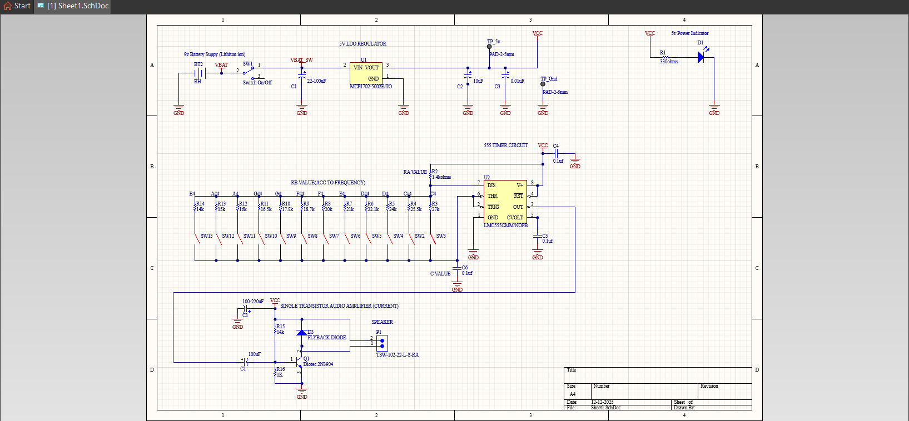
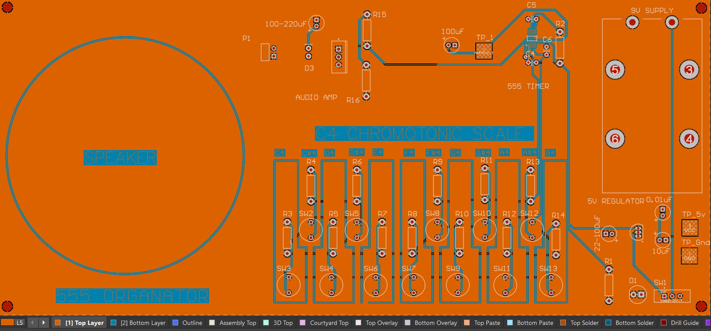
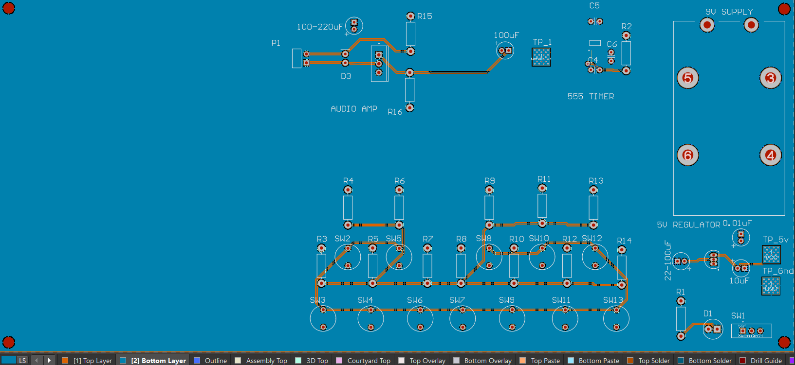

# 555-Timer-Chromatic-Scale-PCB
# 555 Timer Based C4 Chromatic Scale PCB

This repository contains screenshots of a PCB design created as part of my learning in electronics and PCB design.

## Overview
- 555 timer based frequency generation
- Power regulation and basic audio output stage
- Multi-key chromatic scale (C4–B4)
- Focus on PCB layout and routing practices

## Contents
- Schematic screenshots
- PCB layout views (top & bottom)
- 3D PCB render

## Screenshots

### Schematic

### PCB Layout

### 3D View

## Note
Gerber files are not included due to export permission limitations in the design software.
